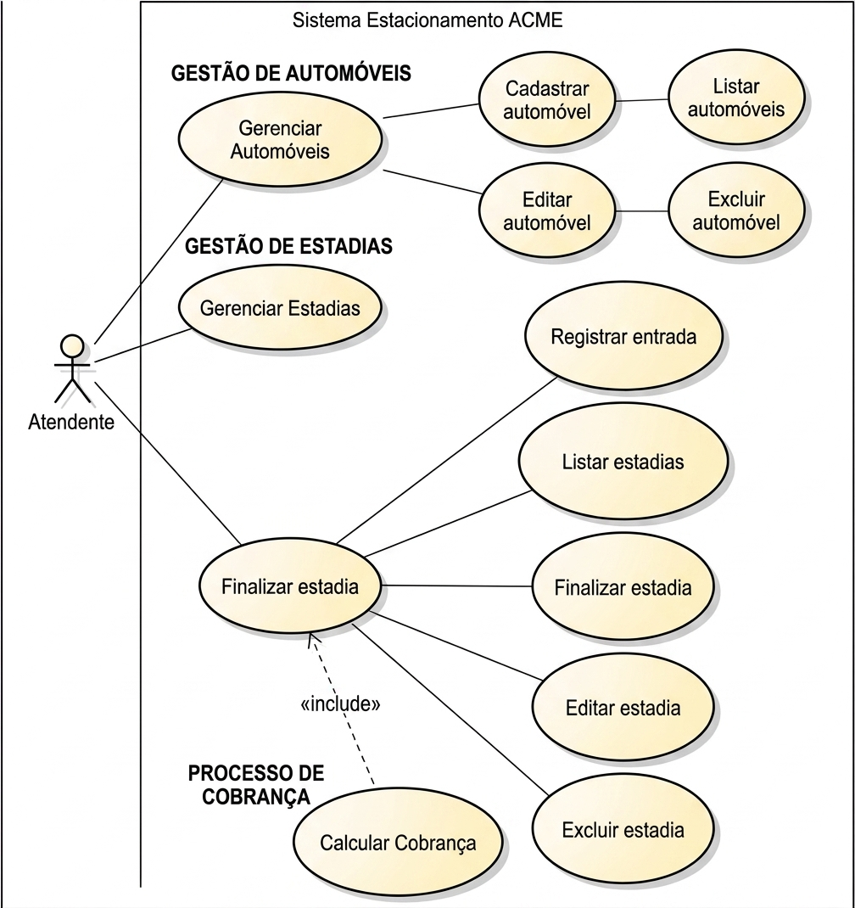
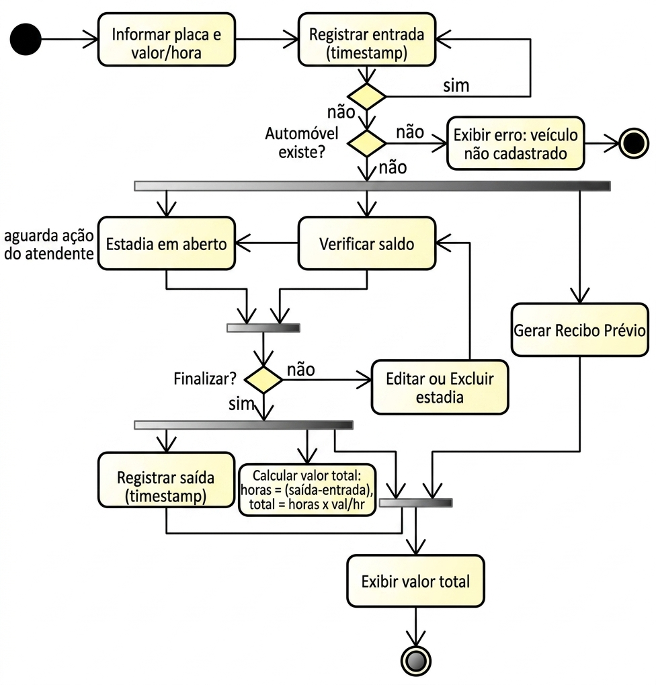
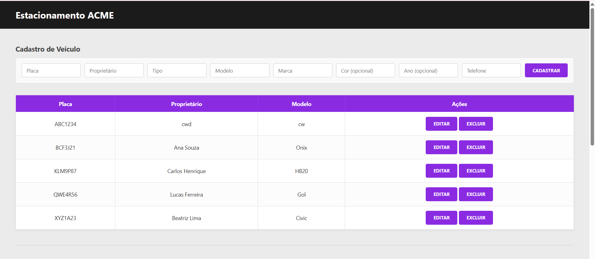
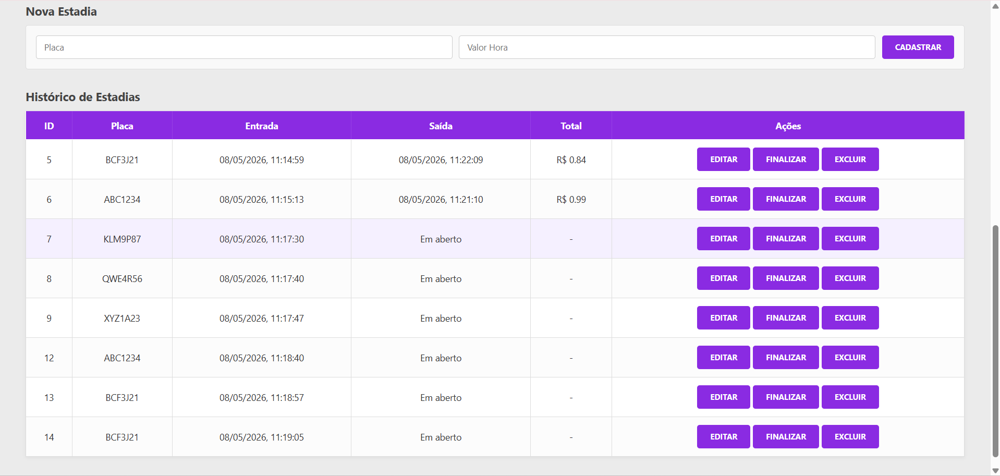

# 🚗 Estacionamento ACME

Sistema de gerenciamento de estacionamento para cadastro de veículos e controle de estadias com cálculo automático de valores.


---

## 📖 Documentação UML

Documentação visual da arquitetura e fluxos do sistema.

### Diagrama de Classes (DC)


### Diagrama de Casos de Uso (DCU)


### Diagrama de Atividades (DA)


---

---

## 📖 Imagens do site

### Cadastro do veículo 


### Cadastro e Histórico de estadias



---

## 🛠️ Tecnologias Utilizadas

| Camada | Tecnologia | Versão |
|:---|:---|:---|
| **Frontend** | HTML5, CSS3, JavaScript (Vanilla) | — |
| **Backend** | Node.js + Express | ≥ 18.x |
| **ORM** | Prisma | ≥ 5.x |
| **Banco de Dados** | SQLite (dev) / PostgreSQL (prod) | — |
| **HTTP Client** | Fetch API (nativo) | — |

---

## 🚀 Como Executar

### Pré-requisitos
- **Node.js** v18 ou superior
- **npm** v9 ou superior

### 1. Clonar e Instalar
```bash
git clone https://github.com/IsabelleBorges26/Atividade-Fork_Estacionamento.git
npm install
```
### 3. Configurar variáveis de ambiente

Crie um arquivo `.env` na raiz do projeto:

```env
PORT=3000
DATABASE_URL="mysql://root@localhost:3306/mydb"
```

### 4. Executar as migrations do banco de dados

```bash
npx prisma migrate dev 
```

### 6. Iniciar o servidor

```
npm run dev
```

O servidor estará disponível em `http://localhost:3000`.

### 7. Abrir o frontend

Abra o arquivo `index.html` diretamente no navegador, ou sirva com uma extensão como **Live Server** (VS Code).

---

## 🧪 Como Testar

### Testar via Interface Web

1. Acesse o `index.html` no navegador
2. **Cadastre um veículo:** preencha todos os campos obrigatórios (Placa, Proprietário, Tipo, Modelo, Marca, Telefone) e clique em **Cadastrar**
3. **Registre uma estadia:** informe a Placa do veículo cadastrado e o Valor por Hora, clique em **Cadastrar**
4. **Finalize a estadia:** clique no botão **Finalizar** na linha da estadia — o valor total será calculado automaticamente
5. **Edite ou exclua** registros usando os botões da tabela
---

## 📁 Estrutura do Projeto

```
estacionamento-acme/
├── web/
│   ├── index.html
│   ├── style.css
│   └── script.js
├── api/
│   ├── controllers/
│   │   ├── automovel.controller.js
│   │   └── estadia.controller.js
│   ├── routes/
│   │   ├── automovel.routes.js
│   │   └── estadia.routes.js
│   ├── data/
│   │   └── prisma.js
│   └── server.js
├── prisma/
│   └── schema.prisma
├── .env
└── package.json
```

---

## 📌 Endpoints da API

| Método | Rota | Descrição |
|--------|------|-----------|
| `POST` | `/automovel/cadastrar` | Cadastra novo automóvel |
| `GET` | `/automovel/listar` | Lista todos os automóveis |
| `GET` | `/automovel/buscar/:placa` | Busca automóvel com estadias |
| `PUT` | `/automovel/atualizar/:placa` | Atualiza dados do automóvel |
| `DELETE` | `/automovel/excluir/:placa` | Remove automóvel |
| `POST` | `/estadia/cadastrar` | Registra nova estadia |
| `GET` | `/estadia/listar` | Lista todas as estadias |
| `GET` | `/estadia/buscar/:id` | Busca estadia por ID |
| `PUT` | `/estadia/atualizar/:id` | Atualiza / finaliza estadia |
| `DELETE` | `/estadia/excluir/:id` | Remove estadia |
